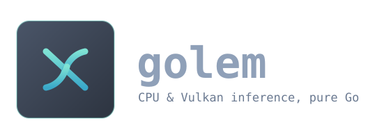

[](https://github.com/ThiraSoft/golem/actions/workflows/test.yml)
[](https://pkg.go.dev/github.com/ThiraSoft/golem)
[](LICENSE)

**CPU inference engines in pure Go.** No Python, no cgo, no GPU, no runtime to
install: `go build`, one static binary, a GGUF file, an answer. On an eight-core
desktop CPU that binary keeps pace with llama.cpp — ahead on the models large
enough for memory bandwidth to be the limit, behind on the smallest, and every
number below is a benchmark in this repository rather than an estimate.

A golem is inert matter given a voice. That is what these engines do to a file
of weights.

## Run it

```bash
go build ./cmd/golem-cli
./golem-cli -model gemma-4-E2B-it-QAT-Q4_0.gguf -p "Explain a mutex in one sentence." -stats
```

Any GGUF the engines implement will do — the file declares its own architecture
and the right engine is opened for it, so no command here names a model family.
The same weights behind an OpenAI-compatible API, tool calls included:

```bash
go build ./cmd/golem-server
./golem-server -model Qwen3-4B-Q4_0.gguf -addr 127.0.0.1:8080
```

Weights are not in this repository; [what is here, and what is not](#what-is-here-and-what-is-not)
says where each one comes from.

## The engines

| | what it runs | against its reference, on the same CPU |
|---|---|---|
| [`gemma/`](gemma/) | Gemma 4 E2B and 12B, from a GGUF | E2B ×1.01 generating, ×1.24 reading a prompt. 12B ×1.04 and ×1.33 — vs llama.cpp |
| [`qwen/`](qwen/) | Qwen3 dense, from a GGUF | 4B ×1.00 and ×1.13. 0.6B ×0.85 and ×0.99 — vs llama.cpp |
| [`pockettts/`](pockettts/) | [Kyutai Pocket TTS](https://github.com/kyutai-labs/pocket-tts), twelve languages, voice cloning included | ×2.22 and ×1.63 the speed of PyTorch, on the 24- and 6-layer models |

In absolute terms, on an i7-9700K with eight threads and Q4_0 weights: Gemma
E2B draws 22.6 tokens a second and reads 204; the 12B, 5.0 and 42. Qwen3 4B,
14.6 and 110. Pocket TTS speaks at ×2.82 real time in French, ×6.55 in English.

**The 0.6B is the one this engine loses**, and `qwen/README.md` says why: at
320 MB the weights fit close enough that the memory bus stops being the limit,
and what is left is arithmetic, where llama.cpp's kernels win. That is the
honest shape of the trade — this engine is built for the regime where reading
the weights is the cost, and it says so where it is not.

Each engine is self-contained. They do not import one another, and nothing in
the shared layer knows they exist.

## The method

**No layer is deemed correct until its intermediate activations match the
reference implementation.**

Scripts load the real weights, inject a deterministic input, and write every
intermediate quantity into `testdata/`. The Go tests read those files back, so
they need neither Python nor llama.cpp at test time — `ref/` says what wrote
each fixture and how to write it again.

For `gemma/` the reference is not PyTorch but llama.cpp itself, instrumented:
the weights on disk are quantized, and a bf16 reference would bury a mistake
under its own quantization error. `ref/gemma/dump_layers.cpp` records every
intermediate under ggml's own names, and the engine is checked against those
recordings — including the parts of ggml that are not the arithmetic anyone
would write, its tabulated GELU and its fp16 caches.

The same rule holds for speed. Every number in these READMEs is a benchmark in
the repository, run on the machine named beside it; nothing is estimated.

## The commands

| | what it does |
|---|---|
| [`cmd/golem-cli`](cmd/golem-cli/) | a conversation with the model, streamed to the terminal |
| [`cmd/golem-server`](cmd/golem-server/) | an OpenAI-compatible API over the same weights, tool calls included |
| `cmd/pocket-tts` | text in, a WAV file out |

Both language commands run either engine, with tools on both. Neither names
one: `-model` takes a GGUF, the file declares its own architecture, and
`engine/` opens whichever implements it.

The server keeps each conversation's tokens between stateless requests and
prefills only what diverged, so a turn costs a turn rather than the whole
prompt. `-parallel` gives it several conversations at once, picks the slot for
a prompt by the longest prefix it already holds, and carries whatever is
waiting through the model in a single pass.

## The shared layer

| package | holds |
|---|---|
| `tensors/` | safetensors and GGUF: metadata, and views on the bytes |
| `nn/` | quantized matrix products with AVX2 kernels, norms, activations, RoPE, convolutions, and the worker pool they are spread over |
| `token/` | tokenizers, one package per family |
| `audio/` | sound formats: reading and writing WAV |
| `sample/` | top-k, top-p, temperature, and a seeded draw over a row of logits |
| `chat/` | a conversation's shape — messages, tools, calls — and the interface an engine implements to write one out |

Nothing is promoted into this layer on the strength of a guess. Code moves here
once two engines are shown to want it, in the same commit that makes them both
use it. `chat/` is the newest of them: the conversation types lived in `gemma/`
until a second engine needed them.

`engine/` is the one package that sits above the engines rather than under
them. It reads `general.architecture` out of a GGUF, opens whichever engine
implements it, and hands back one shape — the forward pass, the vocabulary, the
chat template, and the numbers a startup line prints. It exists so that a
command names no engine, and nothing but a command imports it.

## What it does not do

Worth knowing before you clone it:

- **x86-64 with AVX2 is the only tuned target.** `nn/*.s` is where the speed
  comes from, and it is AVX2. Everything has a pure-Go fallback, so an ARM
  machine runs — an Apple or a Graviton just will not see the numbers above.
  NEON kernels are the largest single thing missing here.
- **No GPU, and none planned.** This is a CPU engine; that is the point of it,
  not a stage on the way somewhere.
- **The server is one process around one model.** `-parallel` answers several
  conversations at once and batches them into one pass, the way llama.cpp's
  does — on E2B, 20.4 tokens a second for one client, 34.9 for two, 52.7 for
  four, against llama-server's 20.4, 33.3 and 59.7 on the same machine — but
  there is no second model, no distribution and no scheduler beyond that.
- **Two language architectures, both dense.** Gemma 4 and Qwen3 dense. No
  mixture of experts, no vision, no embeddings endpoint, no `/v1/completions`.
- **Q4_0, Q6_K, bf16 and float32.** The K-quants beyond Q6_K are not read.
- **The prompt path on Gemma is a factor of one and two thirds behind ggml's
  best**, even where it beats the default build; `gemma/README.md` says where
  the remainder sits.

## What is here, and what is not

No weights, no vocabularies, no voices. They belong to the people who published
them, and they are between three hundred megabytes and three gigabytes each.

- **Gemma 4** weights: a GGUF from Hugging Face, whatever quantization you like
  — the engine reads Q4_0, Q6_K, bf16 and float32, and the tests want the
  QAT Q4_0 build. Point `GOLEM_MODEL` at the file, and `GOLEM_MODEL_12B` at a
  12B one if you have both: the two checkpoints are tested separately, because
  they agree on the architecture's name and on very little else. Google's Gemma
  terms apply to them.
- **Qwen3 dense** weights: a GGUF from Hugging Face declaring `qwen3`. The
  tests want two of the same checkpoint — `GOLEM_MODEL_QWEN` at a bfloat16
  build and `GOLEM_MODEL_QWEN_Q4` at a Q4_0 one made with `llama-quantize
  --pure`, because the kernels and the architecture are two independent places
  for a mistake to hide and bfloat16 removes one of them. Alibaba's Qwen terms
  apply.
- **Pocket TTS** weights, tokenizer and voice states: Kyutai publishes them on
  Hugging Face, and `pockettts/README.md` says which repositories and where the
  engine looks. A voice can also be cloned from any recording, which needs
  nothing but the weights.

Neither are the recordings of the models themselves. `testdata/gemma/layers`,
`layers12`, `quants` and `window`, and `testdata/qwen/layers`, `long` and
`layers_q4`, hold activations, logits and slabs of quantized weights as ggml
computed them; `testdata/layer0`, `pipeline` and `pipeline_en` hold what
PyTorch computes inside Pocket TTS. Those are the models' output, not this
repository's, and each is one command away — `ref/README.md` and
`pockettts/README.md` have them.

What *is* versioned is what the models did not write: tokenizations and chat
templates, which are text and integers. Tests that need a file which is not
there skip rather than fail, so a fresh clone with no model at all still runs
164 of them green, 73 skipped — and a machine with both Gemma checkpoints, a
Qwen3 in two quantizations, the voices and one run of the recorders runs 236.

## Building

```bash
go build ./...
go test ./...
```

Go 1.23 or later, and nothing else. No C compiler, no toolchain, no wheels.

## Feedback wanted

This is one person's reading of two model architectures, checked against their
references and measured on one machine. Both of those are narrow.

What would help most:

- **Numbers from other hardware.** Everything here was tuned on an i7-9700K with
  AVX2 and eight cores:

  ```bash
  GOLEM_MODEL=<a Gemma 4 GGUF> go test ./gemma -run xxx -bench . -benchtime 20x
  ```

  A Zen, an Apple, a machine with more memory channels or none of AVX2 would
  each say something the tuning cannot know.
- **A parity failure.** If a test that compares against llama.cpp or PyTorch
  fails on your setup, that is the most useful bug report this repository can
  get, and the fixtures are exactly what makes it legible.
- **The kernels.** `nn/*.s` is where the time goes, and a NEON path is the one
  thing this repository most obviously lacks.
- **Judgement calls.** Where the code chose one thing and explained itself in a
  comment, the explanation is a claim; if it is wrong, say so.

Issues and pull requests are both fine. So is a note that says only what you ran
and what happened.

## Standing on

- [llama.cpp and ggml](https://github.com/ggml-org/llama.cpp) — the reference
  `gemma/` is measured against, and the source of the Q4_0 and Q6_K block
  formats the kernels here read.
- [Kyutai Pocket TTS](https://github.com/kyutai-labs/pocket-tts) — the model
  `pockettts/` ports, and the daemon that encodes its voices.
- [Gemma](https://ai.google.dev/gemma) — Google DeepMind's models, of which E2B
  is what `gemma/` runs.
- [GGUF](https://github.com/ggml-org/ggml/blob/master/docs/gguf.md) and
  [safetensors](https://github.com/huggingface/safetensors) — the two file
  formats `tensors/` reads.

## License

MIT. See [LICENSE](LICENSE).
