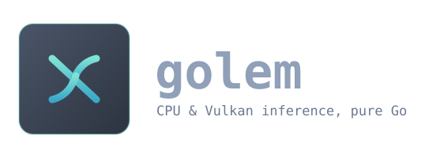
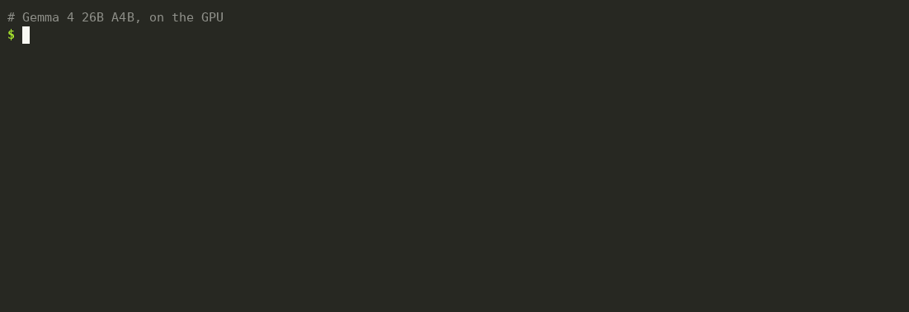

<div align="center">
  

**Local AI in one static Go binary.**  
_LLMs, vision, speech, images and decisions. No Python, no cgo. CPU, or GPU with `-vulkan`._

[](https://github.com/ThiraSoft/golem/actions/workflows/test.yml)
[](https://github.com/ThiraSoft/golem/releases)
[](https://pkg.go.dev/github.com/ThiraSoft/golem)
[](LICENSE)

[Quickstart](#quickstart) · [Speed](#speed) · [What only golem does](#what-only-golem-does) · [How it is checked](#how-it-is-known-to-be-right)



</div>

---

A golem is inert matter given a voice. That is what these engines do to a file of weights.

**Golem** runs Gemma 4, Qwen3, Qwen3.8, Bonsai 2, Kyutai's speech models, Krea 2 and Laya on your own machine. It is one Go binary of about twelve megabytes, with nothing else to install, and it keeps pace with llama.cpp while doing it.

```bash
go install github.com/ThiraSoft/golem/cmd/golem-cli@latest

golem-cli -model gemma-4-E2B-it-QAT-Q4_0.gguf -p "Explain a mutex in one sentence."
```

No Go toolchain? Take a static binary from [the releases](https://github.com/ThiraSoft/golem/releases) for Linux or macOS, amd64 or arm64. There is no configuration file: the engine reads the architecture out of the GGUF and opens the implementation that matches.

## At a glance

On one RX 9070 XT, every figure a benchmark in this repository:

- **Gemma 4 26B A4B at 153 tokens a second**, against 125 for llama.cpp on the same file.
- **The same 26B in 5 GB of VRAM at 56 tokens a second**, experts left in system memory.
- **Bonsai 2 27B at 46 tokens a second**, five times Prism's own llama.cpp fork, and 63 when it drafts.
- **A Krea 2 picture in 8.9 seconds**, the same picture ComfyUI draws for the same seed, at half its time a step.
- **A Laya decision in 7.8 ms**, two and a half times faster than the checkpoint's own PyTorch.

<p align="center">
  <br>
  <sub>Drawn by golem's Krea 2 engine: 1280 × 720, eight steps, 10.4 s on an RX 9070 XT.</sub>
</p>

## What it does

| | |
| --- | --- |
| **Text** | Gemma 4 (E2B, 12B, 26B A4B), Qwen3, Qwen3.8 27B, and Prism's ternary Bonsai 2 27B |
| **Vision** | Gemma 4 and Qwen3.8, from a projector file |
| **Audio in** | Gemma 4 hears WAV, MP3 and FLAC. Kyutai STT transcribes English and French, live from the microphone |
| **Audio out** | Kyutai Pocket TTS, 12 shipped models across 6 languages, and voice cloning from 20 seconds of audio |
| **Images** | Krea 2 from ComfyUI's fp8 files, LoRA included, the same picture as ComfyUI for the same seed |
| **Decisions** | Laya, the open Jev: a state and typed questions in, calibrated probabilities out, in one encoder pass |
| **Embeddings** | nomic-embed-text-v2-moe, behind OpenAI's and ollama's endpoints |
| **Serving** | OpenAI-compatible HTTP API, tool calls, continuous batching, JSON schemas and GBNF grammars |
| **Weights** | GGUF with every K-quant llama.cpp writes, Prism's ternary PQ2_0 and PTQ1_0, and golem's own `.golem` format |

## Quickstart

Every command is `go install github.com/ThiraSoft/golem/cmd/<name>@latest`, or `go build ./cmd/<name>` from a clone. Add `-vulkan` to any of them to run on the GPU.

```bash
golem-cli -model Qwen3-4B-Q4_0.gguf -p "Explain a mutex in one sentence." -stats
```

<details>
<summary><b>Serve an OpenAI-compatible API</b></summary>

```bash
golem-server -model Qwen3-4B-Q4_0.gguf -addr 127.0.0.1:8080 -parallel 4
```

`-parallel N` cuts the context into N slots and holds N conversations at once. Whatever is waiting when a pass is built rides in that pass, so four clients wanting a token are one read of the weights instead of four. The same server answers transcriptions (`-stt`), embeddings (`-embed`) and image generation (`-krea2`). Details in [`cmd/golem-server/README.md`](cmd/golem-server/README.md).

</details>

<details>
<summary><b>Look at a picture, listen to a recording</b></summary>

```bash
golem-cli -model gemma-4-E2B-it-QAT-Q4_0.gguf \
    -mmproj mmproj-gemma-4-E2B-it-QAT-BF16.gguf \
    -image photo.png -p "What is in this picture?"
```

The same flags with `-audio question.wav` make Gemma listen. See [`gemma/README.md`](gemma/README.md).

</details>

<details>
<summary><b>Speak, clone a voice, transcribe</b></summary>

```bash
pocket-tts -voice voice.safetensors -o hello.wav "Bonjour le monde."
pocket-tts -clone someone.wav -save-voice someone.safetensors   # 20s of audio is enough

golem-cli -stt ~/models/stt-1b-en_fr -listen    # microphone in, words out
```

Voice cloning needs no training. Transcription streams at twice real time on eight CPU cores, and about three times on the card. See [`stt/README.md`](stt/README.md) and [`pockettts/README.md`](pockettts/README.md).

</details>

<details>
<summary><b>Draw a picture with Krea 2</b></summary>

```bash
GOLEM_KREA2_COMFY=~/ComfyUI krea2 -prompt "a red fox in the snow, photo" -seed 5 -out fox.png
krea2 -prompt "..." -lora style.safetensors -lora-strength 0.8
```

It reads ComfyUI's own three files where ComfyUI keeps them, and wants a Vulkan card with about 14 GB. See [`krea2/README.md`](krea2/README.md).

</details>

<details>
<summary><b>Ask Laya a decision</b></summary>

```bash
laya -model convaiinnovations/laya -vulkan request.json
```

```json
{
  "state": {"subject": "Refund not received", "body": "..."},
  "questions": {
    "department": {"type": "choice", "instructions": "Which team should handle this email?",
                   "criteria": {"billing": "payments, refunds", "support": "technical problems"}},
    "spam": {"type": "noul", "instructions": "This email is spam."}
  }
}
```

Every option comes back with a calibrated probability, in Jev's shape. The English, typed-decisions and multilingual checkpoints open as Hugging Face ships them. See [`laya/README.md`](laya/README.md).

</details>

<details>
<summary><b>Ask for JSON and get JSON</b></summary>

```bash
golem-cli -model Qwen3-4B-Q4_0.gguf -json-schema city.json -p "Give me the city of Lyon."
```

A model drawing inside a grammar cannot break the document, because every token that would is refused before the draw. `-json`, `-json-schema` and `-grammar` on the command line, `response_format` and `grammar` over the API. The engine is a port of llama.cpp's own, compared against it rule by rule. See [`grammar/README.md`](grammar/README.md).

</details>

<details>
<summary><b>Use it as a library</b></summary>

```go
m, err := engine.Open("Qwen3-4B-Q4_0.gguf", 4096)   // reads the architecture, opens the engine
defer m.Close()

ids := m.Vocab.Encode("Explain a mutex in one sentence.", true, true)
hidden := m.Forward.ForwardBatch(ids, 0)

logits := make([]float32, m.Vocabulary)
m.Forward.Logits(hidden[len(hidden)-1], logits)
```

`engine.Open` hands back one shape whichever family the file is: the forward pass, the vocabulary, the chat template the checkpoint carries, and what to sample with. The commands in `cmd/` are thin wrappers over it, and [pkg.go.dev](https://pkg.go.dev/github.com/ThiraSoft/golem) has the rest.

</details>

## What only golem does

### A mixture's experts need not be on the card

Gemma 4 26B A4B keeps 12.85 GB of experts and reads eight matrices out of a hundred and twenty-eight per block, so eleven of those twelve gigabytes sit untouched on any given token. `GOLEM_MOE_EXPERTS_HOST=1` leaves the experts in system memory the card can address, takes the model's footprint on the card from 13.6 GiB to 1.3, and a cache of the experts a token keeps asking for buys the speed back:

| experts kept in VRAM | that much VRAM | tokens/s |
| --- | ---: | ---: |
| 2 of 128 (the floor) | 0.2 GB | 7.8 |
| 32 of 128 | 3.2 GB | 30.2 |
| **51 of 128** | **5.1 GB** | **56.2** |
| all 128 (fully resident) | 12.9 GB | 131.6 |

Two fifths of the pool buys four fifths of the tokens, and the answers are identical in every row. [`gemma/README.md`](gemma/README.md) has the full curve and the block-by-block residency that runs a 27 GB checkpoint on a 16 GB card.

### Qwen3.8 drafts its own next token

The Qwen3.8 checkpoint ships a block whose job is to guess the token *after* the one just decided. Guess right and the next pass verifies two tokens for the price of one; guess wrong and it costs nothing beyond the pass it rode on. Every token is drawn from the model's own distribution, and a test asserts the answer is the same either way.

On an RX 9070 XT: 27.6 tokens a second one at a time, **40.1 drafting**, 70 % of drafts accepted. Bonsai 2 ships without the block, and the original's grafts onto it unchanged: 46.0 becomes **62.8**. See [`qwen35/README.md`](qwen35/README.md).

### Its own weight format

golem reads GGUF like everyone else. It also writes `.golem`, a trellis code after QTIP, which trades speed for size. On Qwen3-4B against the same bf16 reference, 4088 tokens of wikitext:

| | size | perplexity | KL divergence | top-1 agreement |
| --- | --- | --- | --- | --- |
| bf16 | 7.5 GiB | 19.29 | | |
| Q4_K_M | 2.33 GiB | 20.04 | 0.0715 | 90.1 % |
| **`.golem` H4G** | **1.96 GiB** | 20.07 | **0.0495** | **90.2 %** |
| Q3_K_M | 1.93 GiB | 24.03 | 0.2453 | 79.8 % |
| **`.golem` H3G** | **1.54 GiB** | **21.67** | **0.1715** | **84.6 %** |

H3G is 20 % smaller than Q3_K_M and ahead of it on every column. On Qwen3.8-27B it is 10.45 GiB, closer to bf16 than Q3_K_M, and faster than Q4_0 on the same card: 38.8 tokens a second against 34.1.

```bash
golemquant -model Qwen3-4B-BF16.gguf -out Qwen3-4B.golem -bits 3 -calib wiki.txt
```

[`compress/README.md`](compress/README.md) has the method and the measurements.

## Speed

On an RX 9070 XT against llama.cpp's Vulkan build (`ba1df050f`, b9603), same Q4_0 files, both sides warmed, measured on 2026-09-03 in one sitting. Tokens a second, higher is better:

| | golem gen | llama gen | golem pp512 | llama pp512 |
| --- | ---: | ---: | ---: | ---: |
| Gemma 4 26B A4B | **153.4** | 125.1 | **4434** | 4059 |
| Gemma 4 12B | **72.3** | 64.6 | 2901 | **2978** |
| Qwen3 4B | **180.5** | 172.0 | 5977 | **7117** |
| Qwen3 0.6B | 368.2 | **407.9** | 23445 | **23677** |

Bonsai 2 27B does not load in stock llama.cpp, so it is held against Prism's own fork (`PrismML-Eng/llama.cpp`, `bdc23b5`), same card, 2026-09-23:

| | golem gen | fork gen | golem pp512 | fork pp512 |
| --- | ---: | ---: | ---: | ---: |
| Bonsai 2 27B PQ2_0 | **46.0** | 9.2 | **1253** | 924 |
| Bonsai 2 27B PTQ1_0 | **15.8** | 9.4 | **1128** | 423 |

Against the reference each model was written from, same card, 2026-09-28:

| | golem | reference |
| --- | ---: | ---: |
| Krea 2, one DiT step at 768 × 1024 | **1.02 s** | 1.89 s (ComfyUI) |
| Laya, one question | **7.8 ms** | 19.9 ms (PyTorch) |
| Laya, 32 questions | **51 ms** | 56 ms (PyTorch) |

On an i7-9700K with eight threads and Q4_0 weights, Gemma E2B draws 22.6 tokens a second and reads 204, the 26B A4B does 13.1 and 51, Qwen3 4B does 14.6 and 110: a tie with llama.cpp on generation, and between ×1.06 and ×1.33 reading a prompt.

**Read these tables as a whole: golem reaches llama.cpp's level, and that is the claim.** It is one card and one driver. A kernel that wins on RDNA 4 need not win elsewhere, and the column worth reading is the gap between the two engines rather than the rate. The one model golem loses is Qwen3 0.6B, where the weights are small enough that arithmetic rather than memory sets the pace, and [`qwen/README.md`](qwen/README.md) says why. [ARCHITECTURE.md](ARCHITECTURE.md) has the kernel work, the per-op breakdown against llama.cpp, and the next bottleneck.

## Who this is for

If you ship Go and you need a model to run **on the machine your software already runs on**, this removes the part of that job that hurts. No Python runtime beside your binary, no four-gigabyte CUDA image, no cgo: `GOOS=linux GOARCH=amd64 go build` still produces something you can scp to a box you do not control.

That covers on-premise deployments, edge and embedded boxes, air-gapped machines, CI, and any product where "please install Python 3.11 first" is not a sentence to put in front of a customer. If you run models on your own workstation and a package manager is fine, [Ollama](https://ollama.com) is friendlier.

**Why not bind to llama.cpp?** Because a cgo binding is no longer a static binary. It brings back the C toolchain and a build that breaks differently on every distribution. The price of leaving it out was a full set of kernels: AVX2 and NEON in Go assembly, Vulkan compute bound through `purego` at runtime rather than linked. Four dependencies in all, and `CGO_ENABLED=0 go build ./...` passes.

## How it is known to be right

**No layer is deemed correct until its intermediate activations match the reference implementation.**

Scripts load the real weights, inject a deterministic input, and write every intermediate quantity into `testdata/`. The Go tests read those files back, so they need neither Python nor llama.cpp at test time. For `gemma/` the reference is llama.cpp itself, instrumented, because a bf16 reference would bury a mistake under its own quantization error. For `pockettts/`, `stt/`, `krea2/` and `laya/` it is PyTorch, layer by layer.

### Who wrote this

The code in this repository was written by an AI agent, [Claude](https://claude.com/claude-code), directed and reviewed by a human. Some of the Bonsai 2 work was written by Gemini under Claude's review. The git history says so on the commits themselves.

That is the reason the section above exists. An agent will happily produce a layer that runs, returns plausible tokens and is quietly wrong in the fourth decimal place, and reading the diff does not catch that. Recorded activations do. Every claim in these files is a test in the repository or a benchmark in it. Judge it the way you would judge any dependency you did not write: run the tests, check the numbers, read the parts you are about to trust.

## Project structure

- `cmd/golem-cli`, `cmd/golem-server`, `cmd/pocket-tts`, `cmd/krea2`, `cmd/laya`, `cmd/golemquant` are the commands.
- `engine/` reads the architecture out of a GGUF and opens the engine that implements it.
- `gemma/`, `qwen/`, `qwen35/`, `pockettts/`, `stt/`, `nomic/`, `krea2/`, `laya/` are standalone engines. They do not import one another.
- `nn/` and `vk/` are the shared kernels: quantized AVX2 and NEON, and Vulkan compute.
- `compress/` is the `.golem` format: calibration, the pair-trellis codec, and the conversion pipeline.
- `grammar/` is GBNF and the JSON Schema converter that feeds it.
- `internal/kyutai/` is the Mimi codec, shared by both directions of speech.
- `tensors/`, `token/`, `chat/`, `sample/`, `audio/`, `imageio/` are the rest of the shared layer.
- `ref/` is what recorded each test fixture, and how to record it again.

## Tests

```bash
go test ./...       # correctness on every model and the card, about 17 minutes
```

Weights are not in this repository, and every test that needs one skips cleanly when it cannot find it, which is why the same command is safe on a machine with no models and no card, and why CI runs it.

**Use `-p 1` if you have a GPU.** Several packages put whole models on the card, and two at once want more than 16 GB. Anything slower than thirty seconds waits behind `GOLEM_FULL_TEST=1`; [CONTRIBUTING.md](CONTRIBUTING.md) says which tests those are and why.

## Contributing

The thing we need most is **ARM benchmarks**. The arm64 kernels are correct and tuned by nobody: written and verified under emulation, never once timed on real hardware. If you have Apple Silicon or a Graviton instance, run [`./benchmark-arm.sh`](benchmark-arm.sh) and share what it prints.

After that, bug reports (especially a parity test failing on your setup) and NEON tuning. [CONTRIBUTING.md](CONTRIBUTING.md) has the rest.

## License and credits

Golem is [MIT Licensed](LICENSE).

Standing on the shoulders of giants: [llama.cpp and ggml](https://github.com/ggml-org/llama.cpp), [Kyutai Pocket TTS](https://github.com/kyutai-labs/pocket-tts), [Google Gemma](https://ai.google.dev/gemma), [Krea](https://www.krea.ai) and [ComfyUI](https://github.com/comfyanonymous/ComfyUI), [Convai Innovations' Laya](https://huggingface.co/convaiinnovations/laya), [QTIP](https://github.com/Cornell-RelaxML/qtip) for the bitshift trellis under `.golem`, and [FreeToken](https://arxiv.org/abs/2608.16157), which asked the expert-caching question first and answered it differently.
